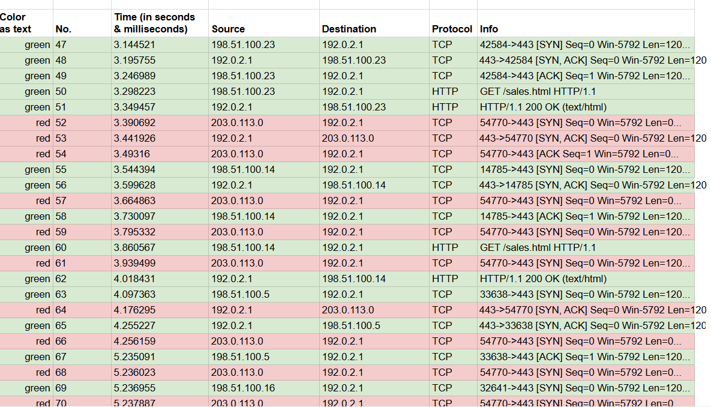

# 🛡️ Incident Report: TCP SYN Flood Attack Analysis

## 📌 Executive Summary
On February 3, 2026, an automated alert signaled a service disruption on the company’s primary web server. Upon investigation, I identified a connection timeout error preventing both employees and customers from accessing vacation package promotions. Analysis of network traffic confirmed a **TCP SYN Flood attack**, which was successfully mitigated through IP blocking and firewall reconfiguration.

---

## 🔍 Technical Analysis & Findings
I used a packet sniffer to capture data packets in transit to the web server to identify the root cause of the timeout.

### 1. The Attack Mechanism
The capture revealed a massive volume of **TCP SYN requests** originating from an unfamiliar IP address. In a standard TCP "Three-Way Handshake," a client sends a SYN, the server responds with a SYN-ACK, and the client finishes with an ACK. 

**Observations during the incident:**
* **Half-Open Connections:** The attacker sent SYN packets but never returned the final ACK.
* **Resource Exhaustion:** The server became overwhelmed trying to maintain these incomplete connections in its backlog, eventually losing the ability to respond to legitimate users.

### 2. Evidence from Wireshark Log (Exhibit A)
By reviewing the exported Wireshark TCP/HTTP log, I distinguished between malicious and benign traffic:
* **Malicious Pattern:** Multiple SYN requests (appearing at log entry #47 and beyond) showed no corresponding ACK from the source IP.
* **Benign Pattern:** Legitimate internal traffic (e.g., from the 172.17.4.0/24 range) successfully completed the handshake and received HTTP responses before the server reached capacity.

*Figure 1: Comparison of a successful handshake vs. the flood of incomplete SYN requests.*

---

## 🛠️ Incident Response & Mitigation
To restore service and protect the network, the following steps were taken:
1. **Service Restoration:** The server was temporarily taken offline to clear the backlog of half-open connections and return to a normal operating status.
2. **Immediate Containment:** I configured the company’s firewall to block the malicious IP address responsible for the flood.
3. **Escalation:** Alerted management to discuss long-term prevention strategies against IP spoofing and larger-scale DDoS attacks.

---

## 🧠 Strategic Recommendations
To prevent a recurrence, I recommend the following security enhancements:
* **Implement SYN Cookies:** This allows the server to handle handshake requests without exhausting memory resources.
* **Rate Limiting:** Configure the firewall to limit the number of SYN packets allowed from a single source per second.
* **Intrusion Detection:** Deploy an IDS/IPS to automatically detect and block pattern-based DoS attacks before they reach the web server.

---
**Source:** This incident scenario and log data are provided by the **Google Cybersecurity Professional Certificate** curriculum on Coursera.
