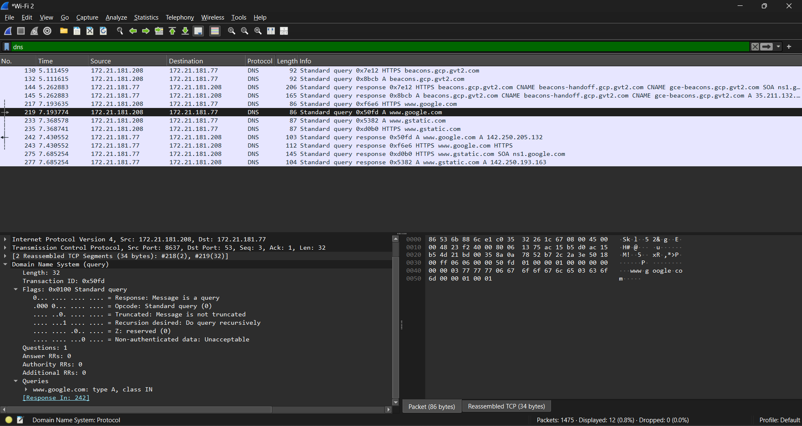

# SOC Analyst Lab: Network Traffic & DNS Analysis
👉 [View my Botium Toys Internal Audit Report](./Botium-Toys-Audit.md)
👉 [View my Incident Report: DNS Troubleshooting](./Incident-Report-DNS-Troubleshooting.md)
👉 [View my Incident Report: SYN Flood Analysis](./Incident-Report-SYN-Flood-Analysis.md)
👉 [View my Incident Report: Brute Force & Malware Redirection](./Incident-Report-Brute-Force-Malware.md)

> **Executive Summary:** This lab demonstrates technical proficiency in network traffic analysis using Wireshark. By isolating and inspecting DNS protocols, I validated system communication integrity—a core competency for SOC Analyst roles.

## 📌 Project Overview
The goal of this project was to establish a baseline for "normal" network traffic and identify how a workstation interacts with the Domain Name System (DNS). Understanding standard traffic is the first step in detecting anomalies like DNS Tunneling or Command & Control (C2) callbacks.

---

## 🛠️ Tools & Environment
* **Network Analyzer:** Wireshark
* **Operating System:** Windows 10
* **Protocols Studied:** DNS (UDP Port 53), UDP, IPv4

---

## 🚀 Lab Implementation Steps

### Phase 1: Environment Configuration
I configured Wireshark to capture traffic on the active network interface. To ensure a clean dataset for analysis, I flushed the local DNS cache and closed non-essential background applications.

### Phase 2: Traffic Capture & Simulation
I initiated a live packet capture while performing manual DNS lookups by navigating to various domains. This allowed me to capture the "Query" and "Response" cycle in real-time.

### Phase 3: Detection & Analysis
Using the display filter `dns`, I isolated the traffic to inspect individual packets. 
- **Finding:** I successfully identified the recursive DNS lookup process. I verified that the destination IP addresses for the DNS queries matched authorized resolvers, ensuring no unauthorized redirection was occurring.

---

## 📈 Visual Documentation
### DNS Traffic Analysis

*Figure 1: Analysis of DNS Query/Response showing the resolution of hostnames to IP addresses.*

---

## 🧠 Key Learning Outcomes
1. **Network Fundamentals:** Deepened understanding of the UDP protocol and the DNS resolution process (OSI Layer 7).
2. **Packet Inspection:** Gained hands-on experience using display filters to find "needles in a haystack" within large capture files.
3. **Cybersecurity Mindset:** Learned to validate that network traffic matches expected patterns, a critical skill for identifying data exfiltration.

---

## 🔗 How to Replicate
1. Install [Wireshark](https://www.wireshark.org/).
2. Select your active network interface and begin a capture.
3. Filter by `dns` to analyze your own workstation's communication.
